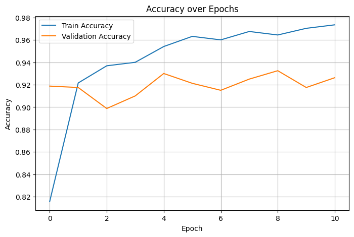
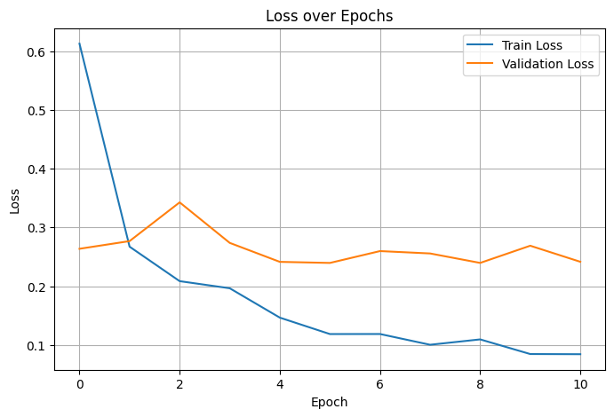
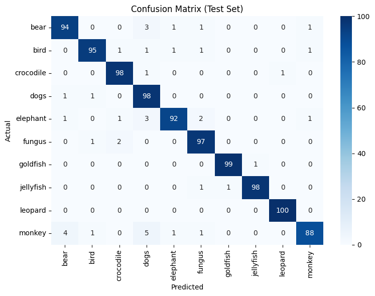
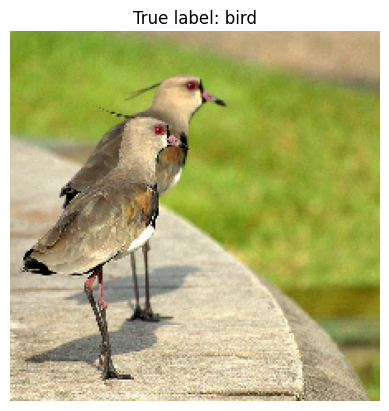

# Image Object Recognition — MobileNetV2 Transfer Learning

Multi-class image classification on the ImageNet-small dataset using transfer
learning with MobileNetV2 (ImageNet-pretrained, frozen base + trained
classification head).

## Setup Instructions

### Dependencies

```bash
pip install tensorflow numpy matplotlib scikit-learn seaborn
```

Tested with:
- Python 3.12
- TensorFlow / Keras (includes `tensorflow.keras.applications.MobileNetV2`)
- numpy, matplotlib
- scikit-learn (for `confusion_matrix`, `classification_report`)
- seaborn (for the confusion matrix heatmap)

### Dataset

Uses the **ImageNet-small dataset** (Kaggle: `(https://www.kaggle.com/datasets/shukdevdatta/imagenetsmall)`),
organized in the standard `flow_from_directory`


If running on Kaggle, attach the dataset via **Add Data** and the notebook's
`train_path` / `test_path` variables will resolve automatically. If running
elsewhere, update `train_path` and `test_path` at the top of the data-loading
cell to point at your local copy of the same folder structure.

### How to Run

1. Open `image-object-recognition-mobilenetv2.ipynb` in Jupyter, Kaggle, or
   Google Colab.
2. **Enable GPU** (Kaggle: Settings → Accelerator → GPU; Colab: Runtime →
   Change runtime type → GPU). Training on CPU will be much slower.
3. Run all cells top to bottom. The notebook will:
   - Load and augment the dataset
   - Build the MobileNetV2-based model
   - Train with `EarlyStopping` + `ReduceLROnPlateau`
   - Evaluate on the held-out test set
   - Run a sample prediction on one test image

## Project Details

### Dataset

- **Source**: ImageNet-small dataset, split into `training_set/` and `test_set/`
  folders, one subfolder per class.
- **Split**: 80% training / 20% validation, carved out of `training_set/` via
  `ImageDataGenerator(validation_split=0.2)`. `test_set/` is held out entirely
  and only used for final evaluation.

### Preprocessing / Augmentation

- Input images resized to **224×224** (MobileNetV2's expected input size).
- Training data augmentation via `ImageDataGenerator`:
  - Rotation (±20°)
  - Width/height shift (±15%)
  - Shear (10%)
  - Zoom (±15%)
  - Horizontal flip
  - `fill_mode='nearest'`
- All splits (train/val/test) use MobileNetV2's `preprocess_input` for pixel
  normalization, matching what the pretrained base expects.

### Model Architecture

Transfer learning on top of **MobileNetV2** (ImageNet weights, `include_top=False`):

```
MobileNetV2 base (frozen, ImageNet weights)
  → GlobalAveragePooling2D
  → Dense(256, activation='relu')
  → Dropout(0.5)
  → Dense(num_classes, activation='softmax')
```

The base network is frozen — only the small classification head is trained.
This keeps the number of trainable parameters low, which trains much faster
and generalizes better on a small dataset than training a deep CNN from
scratch.

### Training Approach

- **Optimizer**: Adam
- **Loss**: categorical cross-entropy
- **Epochs**: up to 20, with:
  - `EarlyStopping(monitor='val_loss', patience=5, restore_best_weights=True)`
  - `ReduceLROnPlateau(monitor='val_loss', factor=0.5, patience=3, min_lr=1e-6)`
- Training and validation accuracy/loss are tracked and plotted per epoch.

### Evaluation

- Test-set loss and accuracy via `model.evaluate()`.
- Full `classification_report` (precision/recall/F1 per class).
- Confusion matrix, visualized as a heatmap.
- A qualitative sample prediction: one test image is loaded, run through the
  trained model, and shown with its predicted class and confidence score.

## Output Preview

**Dataset**: 10 classes — bear, bird, crocodile, dogs, elephant, fungus,
goldfish, jellyfish, leopard, monkey (3200 train / 800 validation / 1000 test
images).

**Test results**: `Test Accuracy: 0.9590` · `Test Loss: 0.1517`

Per-class precision/recall/F1 (test set):

| Class     | Precision | Recall | F1   |
|-----------|-----------|--------|------|
| bear      | 0.94      | 0.94   | 0.94 |
| bird      | 0.97      | 0.95   | 0.96 |
| crocodile | 0.96      | 0.98   | 0.97 |
| dogs      | 0.88      | 0.98   | 0.93 |
| elephant  | 0.97      | 0.92   | 0.94 |
| fungus    | 0.94      | 0.97   | 0.96 |
| goldfish  | 0.99      | 0.99   | 0.99 |
| jellyfish | 0.99      | 0.98   | 0.98 |
| leopard   | 0.99      | 1.00   | 1.00 |
| monkey    | 0.97      | 0.88   | 0.92 |

**Training curves** (accuracy and loss, train vs. validation):




**Confusion matrix** on the test set:



**Sample prediction** — test image (true label: bird), model predicted
`bird` with 100.00% confidence:


